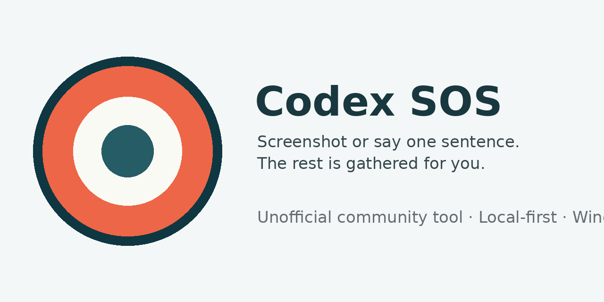

# Codex SOS



[](https://github.com/djshitiancai2023-commits/codex-sos/actions/workflows/ci.yml)
[](https://github.com/djshitiancai2023-commits/codex-sos/releases/latest)
[](LICENSE)

> **Codex 一卡住，按一下救生圈。 / When Codex gets stuck, press the lifebuoy.**

Codex SOS is an unofficial, local-first Windows helper for people who use Codex but do not want to read logs, run diagnostic commands, or learn GitHub. Paste an error screenshot or describe the problem in one sentence; Codex SOS gathers bounded diagnostics, runs the official `codex doctor --json` when available, looks for similar public issues, protects private details, and suggests a conservative next step.

**No API key. No model call. No automatic repair or posting.**

[中文说明](README.zh-CN.md) · [Download the latest Windows release](https://github.com/djshitiancai2023-commits/codex-sos/releases/latest) · [Privacy](PRIVACY.md) · [Security](SECURITY.md) · [Code signing policy](CODE_SIGNING_POLICY.md)

> **Unofficial community project. Not affiliated with or endorsed by OpenAI.** Codex SOS does not use OpenAI branding or logos.

## Quick download (Windows x64)

[Download the portable ZIP](https://github.com/djshitiancai2023-commits/codex-sos/releases/download/v0.1.1/Codex-SOS-0.1.1-win-x64-portable.zip)

Directly download the ZIP. Then right-click it, choose **Extract All**, and double-click `CodexSOS.exe`. No GitHub sign-in or star is required.

The installer is optional when you want a Start-menu entry and an uninstaller.

## Why it exists

A screenshot alone often leaves maintainers asking for the Codex version, Windows version, exact error text, reproduction steps, and diagnostic output. Running `codex doctor --json` helps, but the report does not know what appeared on the user's screen, does not compare similar public issues, and a green report cannot rule out runtime failures.

Codex SOS combines the user's visible symptom with small, bounded checks and keeps the conclusions deliberately cautious.

## What the user does

1. Open Codex SOS.
2. Paste/select a screenshot **or** write one sentence about what happened.
3. Click the large check button.

The result page answers four questions:

1. What kind of problem might this be?
2. Have other users reported something similar?
3. What is the safest next step?
4. What can be saved if more help is needed?

## What it checks

- Local OCR for common English error text in a user-provided screenshot
- Windows and Codex version, running state, and obvious duplicate-install clues
- Official `codex doctor --json`, with graceful handling for unsupported, failed, timed-out, malformed, and changed output
- A narrow time window of Windows application fault events related to Codex
- OpenAI's public service-status page
- Public `openai/codex` issues using a small set of redacted, stable error terms
- Explainable fixed rules for conservative classification and safe next steps
- A second redaction pass before any report is saved

## Privacy and networking

- The original screenshot is processed locally and is not included in the public report by default.
- Codex SOS does not open `auth.json`, full conversations, prompts, session files, or project source code.
- It does not call the OpenAI API or any model.
- To check public service health, it reads OpenAI's public status page.
- To look for known problems, it may send a few redacted error terms to GitHub's public issue search. The original screenshot, full description, and full report are not sent.
- Reports are not posted automatically. The user must review and save them manually.

Automatic redaction is not a guarantee. Review exported material before publishing it. See [PRIVACY.md](PRIVACY.md) for the exact boundary.

## Code signing

Public Windows releases use the signing policy in [CODE_SIGNING_POLICY.md](CODE_SIGNING_POLICY.md).
The v0.1.0 and v0.1.1 releases are unsigned. A later release will only
be described as signed after its installer and portable application pass
Windows Authenticode verification.

## Download

For ordinary Windows users, start with the [portable ZIP](https://github.com/djshitiancai2023-commits/codex-sos/releases/download/v0.1.1/Codex-SOS-0.1.1-win-x64-portable.zip). It runs without installation:

- `Codex-SOS-0.1.1-win-x64-portable.zip` — download, choose **Extract All**, then double-click `CodexSOS.exe`
- `Codex-SOS-Setup-0.1.1.exe` — optional when you want a Start-menu entry and an uninstaller
- `SHA256SUMS.txt` — integrity checksums

The current public builds are unsigned, so Windows may show an unknown-publisher warning. Verify the SHA-256 checksum from the release page and do not disable Windows security protections to bypass a warning.

## What it will not do

- Delete caches, sessions, databases, or Codex data
- Reinstall Codex, reset sign-in, or change network settings
- Read the complete `.codex` directory or user projects
- Automatically create or comment on a GitHub issue
- Claim that a probable category is a confirmed root cause
- Claim that Codex is healthy just because `codex doctor` is green

## Current scope

- Windows x64 first, with Windows 11 as the primary acceptance target
- Common English error text for local screenshot OCR; Chinese descriptions can be typed directly
- Fixed, explainable diagnostic rules rather than model-generated diagnosis
- Unsigned Windows builds in v0.1.0 and v0.1.1

## Build and test

The repository contains the original application source, executable tests with synthetic fixtures, the Windows packaging script, and the Inno Setup installer definition.

```powershell
pwsh ./scripts/check-source-secrets.ps1
pwsh ./scripts/test.ps1
pwsh ./scripts/build-release.ps1 -Version 0.1.0
```

See [BUILDING.md](BUILDING.md), [CONTRIBUTING.md](CONTRIBUTING.md), and [docs/ARCHITECTURE.md](docs/ARCHITECTURE.md).

## Security

Never attach real tokens, `auth.json`, full sessions, customer data, proprietary project material, or unredacted screenshots to a public issue. Use a fully synthetic example and follow [SECURITY.md](SECURITY.md).

## License

Codex SOS is released under the [MIT License](LICENSE). Bundled third-party components retain their own licenses; see [THIRD_PARTY_NOTICES.md](THIRD_PARTY_NOTICES.md).
